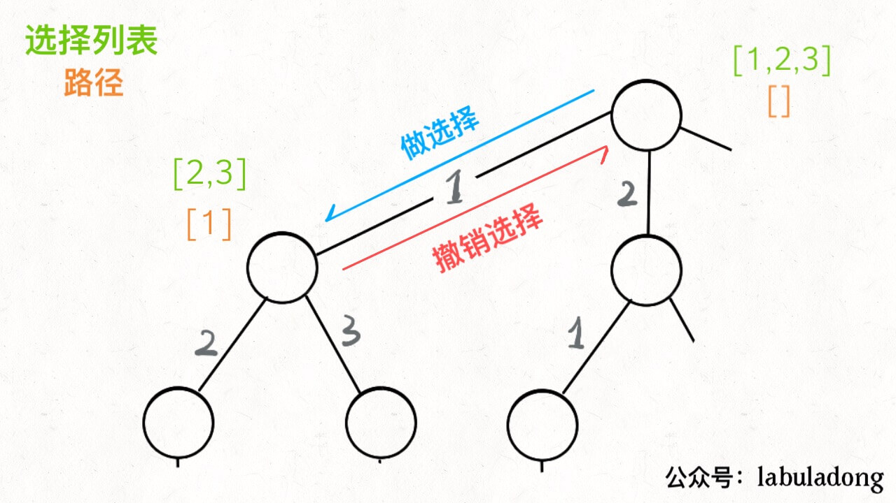
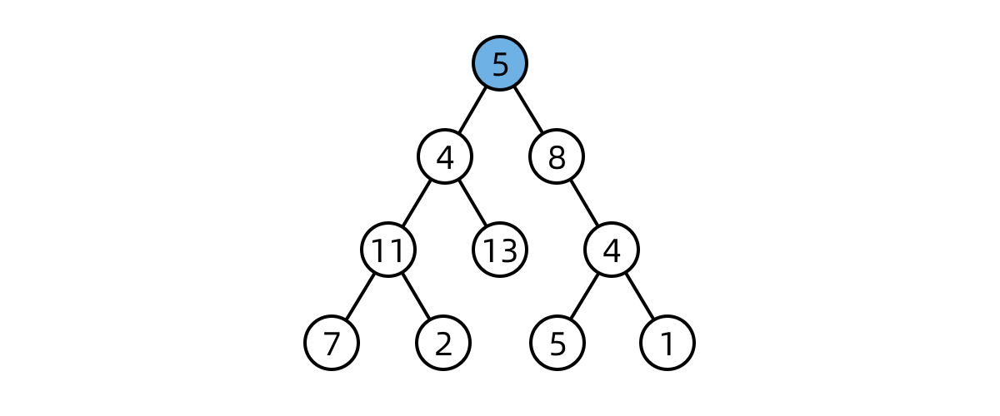
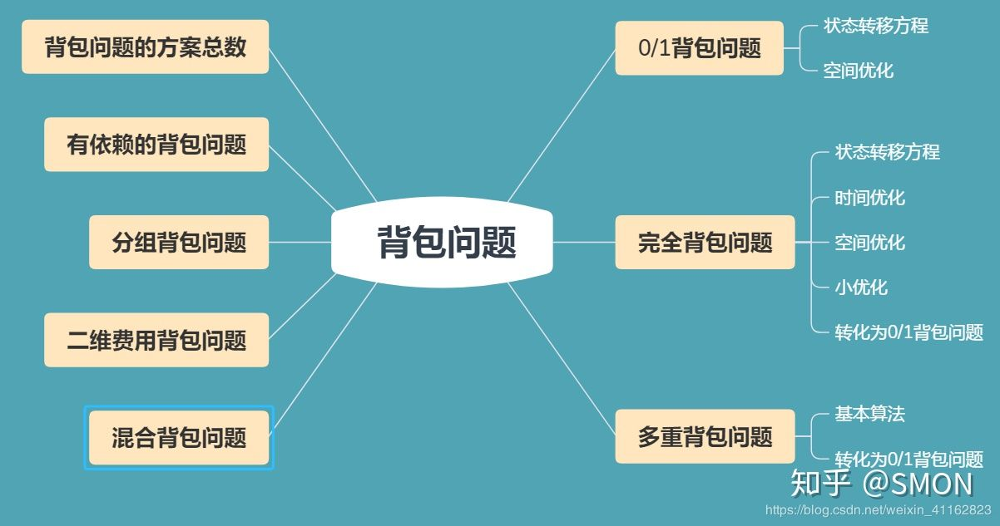
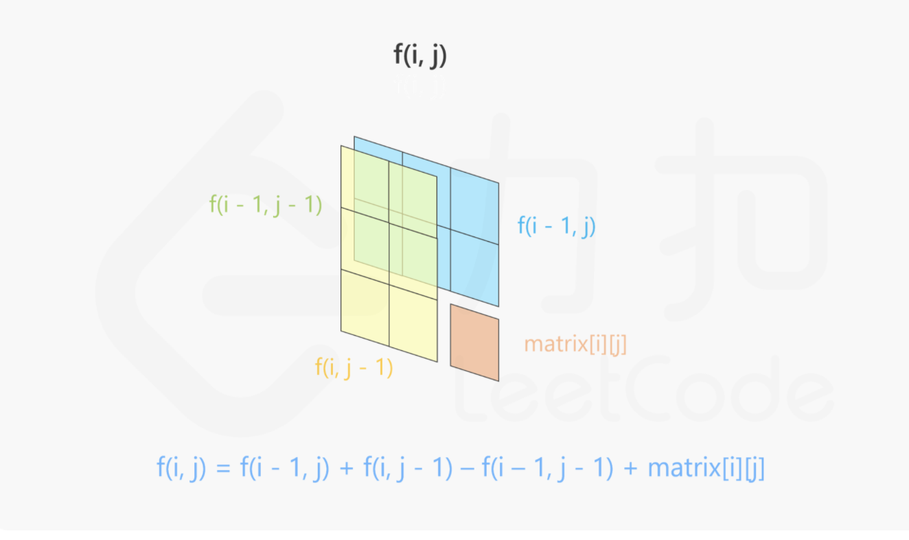
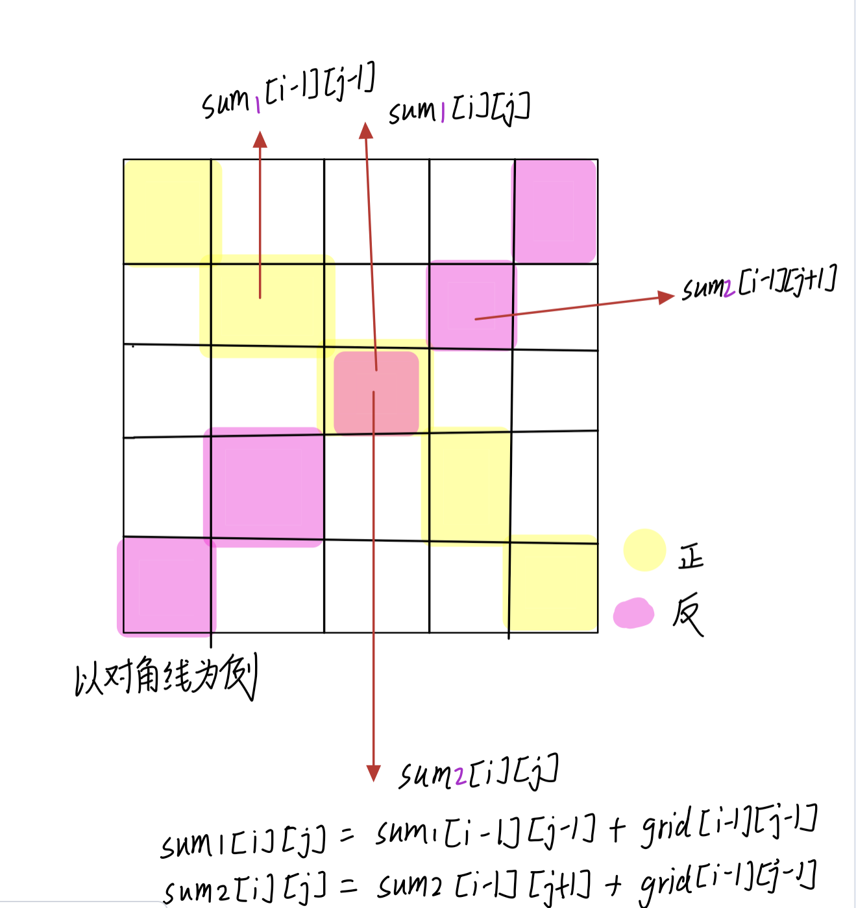
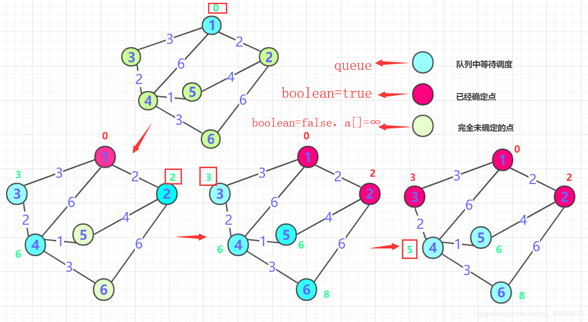
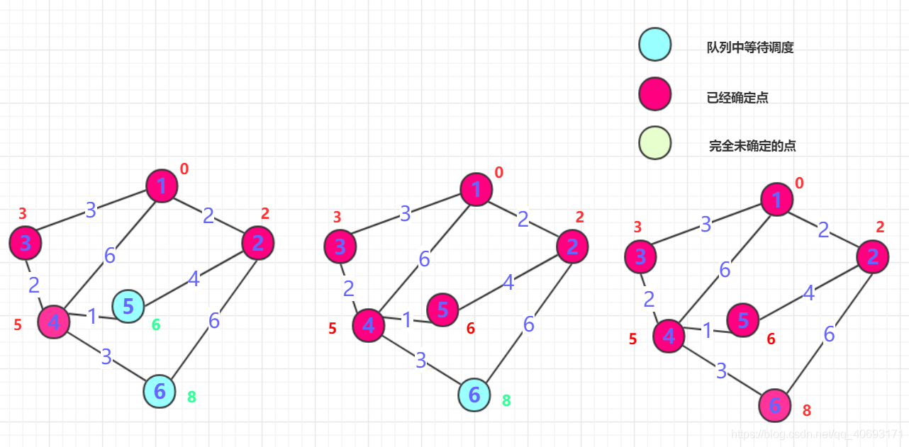
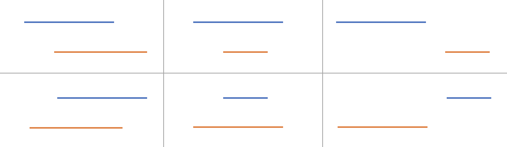

## 滑动窗口
### 不定长滑动窗口
#### 模板
《挑战程序设计竞赛》这本书中把滑动窗口叫做「虫取法」，我觉得非常生动形象。因为滑动窗口的两个指针移动的过程和虫子爬动的过程非常像：前脚不动，把后脚移动过来；后脚不动，把前脚向前移动。下面的滑动窗口的模板，能解决大多数的滑动窗口问题。

滑动窗口中用到了左右两个指针，它们移动的思路是：
**以右指针作为驱动，拖着左指针向前走。右指针每次只移动一步，而左指针在内部 while 循环中每次可能移动多步。右指针是主动前移，探索未知的新区域；左指针是被迫移动，负责寻找满足题意的区间。**

```
def findSubArray(nums):
    N = len(nums) # 数组/字符串长度
    left, right = 0, 0 # 双指针，表示当前遍历的区间[left, right]，闭区间
    sums = 0 # 用于统计 子数组/子区间 是否有效，根据题目可能会改成求和/计数
    res = 0 # 保存最大的满足题目要求的 子数组/子串 长度
    while right < N: # 当右边的指针没有搜索到 数组/字符串 的结尾
        sums += nums[right] # 增加当前右边指针的数字/字符的求和/计数
        while 区间[left, right]不符合题意：# 此时需要一直移动左指针，直至找到一个符合题意的区间
            sums -= nums[left] # 移动左指针前需要从counter中减少left位置字符的求和/计数
            left += 1 # 真正的移动左指针，注意不能跟上面一行代码写反
        # 到 while 结束时，我们找到了一个符合题意要求的 子数组/子串
        res = max(res, right - left + 1) # 需要更新结果
        right += 1 # 移动右指针，去探索新的区间
    return res

```
#### 相关题目

题目|问题类型|窗口数据特点|辅助数据结构
| --- | --- | --- | --- |
3| 无重复字符的最长子串|最长子串|不含重复字符|bitset
30| 串联所有单词的子串|所有符合的子串|词典所有词的拼接|哈希表
76| 最小覆盖子串|最短子串|字符计数包围另一串t|哈希表
159| 至多包含两个不同字符的最长子串|最长子串|至多两个不同字符|无
424| 替换后的最长重复字符|最长子串|含重复字母,可以替换k次|哈希表
487| 最大连续1的个数 II|最长子串|连续1, 可以替换1次|无
532| 数组中的 k-diff 数对|子串数目|端点值差的绝对值为 k|无
467| 环绕字符串中唯一的子字符串|子串数目|为另一串p的非空子串|无
713| 乘积小于K的子数组|子数组数目|乘积小于k|无
845| 数组中的最长山脉|最长子数组|山脉数组|无
904| 水果成篮|最长子数组|最多两种不同数字|无
992| K 个不同整数的子数组|子数组数目|K 中不同数字|哈希表
795| 区间子数组个数|子数组数目|最大元素在 [L, r] 之间|无
395| 至少有K个重复字符的最长子串|最长子串|每个字符出现次数均>=k|哈希表
1004| 最大连续1的个数 III|最长子数组|连续1,最多替换k次|无
1234| 替换子串得到平衡字符串|最短子串|给定字符限定最少次数|哈希表
1358| 包含所有三种字符的子字符串数目|子串数目|给定字符限定最少次数|哈希表
面试题 17|18| 最短超串|最短子数组|字符计数包围另一数组|哈希表
340| 至多包含 K 个不同字符的最长子串|最长子串|至多k个不同字符|哈希表
209| 长度最小的子数组|最短子数组|和 >= s|无
727| 最小窗口子序列|最短子串|另一串 t 为其子序列|无
1208| 尽可能使字符串相等|最长子串|转换为另一串t的成本 <= k|无
1100| 长度为 K 的无重复字符子串|子串数目|无重复字符|bitset

[子串相关的不定长滑动窗口问题汇总](https://leetcode-cn.com/circle/discuss/2rWwO4/)

[Leetcode滑动窗口题目全集](https://leetcode-cn.com/problemset/all/?topicSlugs=sliding-window)

### 固定长度滑动窗口

#### 模板
```
    Deque<Integer> dq = new ArrayDeque<>();
    for (int i = 0; i < nums.length; i++) {
        // move right: build cur window
        addTail(dq, nums[i]);
        if (i >= k - 1) {
            // get cur window
            res[i - k + 1] = dq.peekFirst();
            // remove left: prepare
            removeFront(dq, nums[i - k + 1]);
        }
    }
```
#### 相关题目：
[239. 滑动窗口最大值](https://leetcode-cn.com/problems/sliding-window-maximum/)
方法： 模板[固定滑动窗口] + 降序Deque
[480. 滑动窗口中位数](https://leetcode-cn.com/problems/sliding-window-median/)
方法： 模板[固定滑动窗口] + 大小堆

### DFS
#### 模板
解决一个回溯问题，实际上就是一个决策树的遍历过程。你只需要思考 3 个问题：
1、路径：也就是已经做出的选择。
2、选择列表：也就是你当前可以做的选择。
3、结束条件：也就是到达决策树底层，无法再做选择的条件。

```
result = []
def backtrack(路径, 选择列表):
    if 满足结束条件:
        result.add(路径)
        return

    for 选择 in 选择列表:
        做选择
        backtrack(路径, 选择列表)
        撤销选择
```



#### 回溯注意事项

当回到上一级的时候，所有的状态变量需要重置为第一次来到该结点的状态，这样继续尝试新的选择才有意义；
在代码层面上，需要在递归结束以后，添加递归之前的操作的逆向操作；

##### 回溯终止
注意path加入结果时，需要拷贝新的path。

##### 是否需要回溯
每一次尝试都「复制」，则不需要回溯
如果在每一个 非叶子结点 分支的尝试，都创建 新的变量 表示状态，那么在回到上一层结点的时候不需要「回溯」；
在递归终止的时候也不需要做拷贝。

##### 基本类型变量和对象类型变量的不同处理
基本类型变量每一次向下传递的时候的行为是复制，所以无需重置；
对象类型变量在遍历的全程只有一份，因此再回退的时候需要重置；
类比于 Java 中的 方法参数 的传递机制：
基本类型变量在方法传递的过程中的行为是复制，每一次传递复制了参数的值；
对象类型变量在方法传递的过程中复制的是对象地址，对象全程在内存中共享地址。

##### 字符串问题的特殊性
如果使用 + 拼接字符串，每一次拼接产生新的字符串，因此无需重置（无需回溯）；
如果使用 StringBuilder 拼接字符串，整个搜索的过程 StringBuilder 对象只有一份，需要状态重置（需回溯）。

##### 剪支


#### 题型一：排列、组合、子集相关问题


##### 组合：序列1~n中取出k个元素的各种取法。节点i与节点j(j = i+1, … , n)都相连接，DFS遍历整张有向图。
```
public List<List<Integer>> combine(int n, int k) {
    List<List<Integer>> result = new ArrayList<>();
    if (n <= 0 || n < k) {
        return result;
    }
    List<Integer> path = new ArrayList<>();
    dfs(n, k, 1, path, result);
    return result;
}

// DFS for combination
private void dfs(int n, int k, int start,
                 List<Integer> path, List<List<Integer>> result) {
    if (tmp.size() == k) {
        result.add(new ArrayList<Integer>(path));
        return;
    }
    for (int i = start; i <= n; i++) {
        path.add(i);
        dfs(n, k, i + 1, path, result);
        path.remove(path.size() - 1); // remove the last
    }
}
```
##### 排列：与组合比，节点i与其他所有节点都连接。因此，所构造的图是一个完全连通图。
```
public List<List<Integer>> permute(int[] nums) {
    List<List<Integer>> result = new ArrayList<>();
    if (nums.length == 0) {
        return result;
    }
    List<Integer> path = new ArrayList<>();
    dfs(nums, path, result);
    return result;
}

// DFS for permutation
private void dfs(int[] nums, List<Integer> path,
                 List<List<Integer>> result) {
    int n = nums.length;
    if (path.size() == n) {
        result.add(new ArrayList<>(tmp));
        return;
    }
    for (int i = 0; i < n; i++) {
        // nums[i] has not been visited
        if (!path.contains(nums[i])) {
            path.add(nums[i]);
            dfs(nums, path, result);
            path.remove(path.size() - 1);
        }
    }
}
```
##### 筛选：从n个中选不确定个数
```
private void dfs(int[] nums, int start, List<Integer> path,
                 List<List<Integer>> result) {
    if (start == nums.length) {
        result.add(new ArrayList<>(path);
        return;
    }
    // 如果满足条件，可以选第start个点
    if (isValid(nums, start, path) {
        path.add(nums[i]);
        dfs(nums, start + 1, path, result);
        path.remove(path.size() - 1); // remove the last
    }
    // 否则，跳过第start个点
    dfs(nums, start + 1, path, result);
}
```
#### 二分图
二分图染色
通过黑白染色我们可以判断一个无向图是否二分图:
遍历整个图, 将相邻的节点染成不同的颜色, 如果可以完成这个遍历(即染色过程没有冲突), 说明是二分图.

https://www.lintcode.com/problem/possible-bipartition/
https://leetcode-cn.com/circle/article/SCLpQf/

#### 二叉树


##### 自顶向下
说明：从某一个节点(不一定是根节点)，从上向下寻找路径，到某一个节点(不一定是叶节点)结束
###### 模板
```
// DFS: 自顶向下，可不包含root
dfsNoRoot() {
    // 终止条件：空
    // 选root：注意
    dfsRoot(root);
    // 处理左子
    dfsNoRoot(root.left);
    // 处理右子
    dfsNoRoot(root.right);
}
// DFS：自顶向下，包含root
dfsRoot() {
    // 终止条件：空
    // 处理当前节点：如更新变量等
    // 处理左子
    dfs(root.left, sum);
    // 处理右子
    dfs(root.right, sum);
}
```
```
# 一般路径：
private List<StringBuilder> result;
void dfs(TreeNode root, StringBuilder path） {
    if (root == null) { //根节点为空直接返回
        return;
    }
    path.append(root.val); //作出选择
    if (root.left == null && root.right == null) { //如果到叶节点  
        res.add(new StringBuilder(path);
        return;
    }
    dfs(root->left, path);
    dfs(root->right, path);
    path.deleteCharAt(path.length() - 1); // 回溯：String或int不需要
}

# 给定和的路径:
void dfs(TreeNode root, int sum, StringBuilder path） {
    if (root == null) { //根节点为空直接返回
        return;
    }
    sum -= root.val;
    path.append(root.val); //作出选择
    if (root.left == null && root.right == null) { //如果到叶节点  
        res.add(new StringBuilder(path);
        return;
    }
    dfs(root->left, sum, path);
    dfs(root->right, sum, path);
    path.deleteCharAt(path.length() - 1); // 回溯：String或int不需要
}
```
注意：
1、如果是找路径和等于给定target的路径的，那么可以不用新增一个临时变量cursum来判断当前路径和，只需要用给定和target减去节点值，最终结束条件判断target==0即可
2、**是否要回溯**：StringBuilder, List等需要回溯，基础类型String，int等不需要。
3、**找到路径后是否要return**:取决于题目是否要求找到叶节点满足条件的路径,如果必须到叶节点,那么就要return;但如果是到任意节点都可以，那么必不能return,因为这条路径下面还可能有更深的路径满足条件，还要在此基础上继续递归
4、是否要**双重递归**(即调用根节点的dfs函数后，继续调用根左右节点的pathsum函数)：看题目要不要求从根节点开始的，还是从任意节点开始

具体题目如下：
257. 二叉树的所有路径
面试题 04.12. 求和路径
112. 路径总和
113. 路径总和 II
437. 路径总和 III
988. 从叶结点开始的最小字符串

##### 非自顶向下：
```
    // 先dfs建立parent的hash表：node -> parent。
    dfsBuildGraph() {
        // 终止条件：空
        if (root.left != null) {  // 向左子
            graph.put(root.left.val, root);
            dfsBuildGraph(root.left);
        }
        if (root.right != null) { // 向右子
            graph.put(root.right.val, root);
            dfsBuildGraph(root.right);
        }
    }
    
    // 再从target出发dfs找答案，分三条路left/right/parent，通过prev和next不同保障不走回头路。
    dfsGetResult(cur, prev, int k) {
        // 终止条件：加入结果
        if (cur.left != null && cur.left != prev) { // 向左子
            dfsGetResult(cur.left, cur, k - 1);
        }
        if (cur.right != null && cur.right != prev) { // 向右子
            dfsGetResult(cur.right, cur, k - 1);            
        }
        TreeNode parent = graph.get(cur.val);
        if (parent != null && parent != prev) { // 向父
            dfsGetResult(parent, cur, k - 1);
        }
    }
```
说明：就是**从任意节点到任意节点的路径**，不需要自顶向下
解题思路：设计一个辅助函数maxpath，调用自身求出**以一个节点出发（不是以此节点为根）**的左侧最长路径left和右侧最长路径right，那么经过该节点的最长路径就是left + right
```
int res=0;
int maxPath(TreeNode *root) //以root为路径起始点的最长路径
{
    if (!root)
        return 0;
    int left=maxPath(root->left);
    int right=maxPath(root->right);
    res = max(res, left + right + root->val); //更新全局变量  
    return max(left, right);   //返回左右路径较长者
}
```
注意点：
1、left,right代表的含义要根据题目所求设置，比如最长路径、最大路径和等等
2、全局变量res的初值设置是0还是INT_MIN要看题目节点是否存在负值,如果存在就用INT_MIN，否则就是0
3、注意两点之间路径为1，因此一个点是不能构成路径的

124. 二叉树中的最大路径和
687. 最长同值路径
543. 二叉树的直径

### BFS

#### 双向BFS
「双向 BFS」的基本实现思路如下：

* 创建「两个队列」分别用于两个方向的搜索；
* 创建「两个哈希表」用于「解决相同节点重复搜索」和「记录转换次数」；
* 为了尽可能让两个搜索方向“平均”，每次从队列中取值进行扩展时，先判断哪个队列容量较少；
* 如果在搜索过程中「搜索到对方搜索过的节点」，说明找到了最短路径。

```
d1、d2 为两个方向的队列
m1、m2 为两个方向的哈希表，记录每个节点距离起点的
    
// 只有两个队列都不空，才有必要继续往下搜索
// 如果其中一个队列空了，说明从某个方向搜到底都搜不到该方向的目标节点
while(!d1.isEmpty() && !d2.isEmpty()) {
    if (d1.size() < d2.size()) {
        update(d1, m1, m2);
    } else {
        update(d2, m2, m1);
    }
}

// update 为从队列 d 中取出一个元素进行「一次完整扩展」的逻辑
void/int/boolean update(Deque d, Map cur, Map other) {
    cur = q.poll();
    // 遍历下一个可能性
}
```
链接：https://leetcode-cn.com/problems/word-ladder/solution/gong-shui-san-xie-ru-he-shi-yong-shuang-magjd/
```
1751 · 牛郎织女

    private final static int[][] DIRS = {{-1, 0}, {1, 0}, {0, -1}, {0, 1}};

    public boolean findHer(String[] maze) {
        if (maze.length == 0) {
            return false;
        }
        int m = maze.length;
        int n = maze[0].length();
        char[][] matrix = buildMatrix(maze);
        int begin = find(matrix, 'S');
        int end = find(matrix, 'T');
        Queue<Integer> q1 = new LinkedList<>();
        Queue<Integer> q2 = new LinkedList<>();
        Set<Integer> v1 = new HashSet();
        Set<Integer> v2 = new HashSet();
        q1.add(begin);
        q2.add(end);
        v1.add(begin);
        v2.add(end);
        while (!q1.isEmpty() && !q2.isEmpty()) {
            boolean found = false;
            if (q1.size() < q2.size()) {
                found = update(q1, v1, v2, matrix);
            } else {
                found = update(q2, v2, v1, matrix);
            }
            if (found) {
                return true;
            }
        }
        return false;
    }

    private boolean update(Queue<Integer> q1, Set<Integer> v1, Set<Integer> v2, char[][] matrix) {
        int m = matrix.length;
        int n = matrix[0].length;
        boolean ans = false;
        int cur = q1.poll();
        int x = cur % n;
        int y = cur / n;
        for (int i = 0; i < DIRS.length; i++) {
            int nx = x + DIRS[i][0];
            int ny = y + DIRS[i][1];
            int next = nx * n + m;
            if (!isValid(matrix, nx, ny)) {
                continue;
            }
            if (v1.contains(next)) {
                continue;
            }
            if (v2.contains(next)) {
                return true;
            }
            q1.add(next);
            v1.add(next);
        }
        return false;
    }

    private int find(char[][] matrix, char c) {
        for (int i = 0; i < matrix.length; i++) {
            for (int j = 0; j < matrix[0].length; j++) {
                if (matrix[i][j] == c) {
                    return i * matrix[0].length + j;
                }
            }
        }
        return -1;
    }

    private boolean isValid(char[][] matrix, int x, int y) {
        int m = matrix.length;
        int n = matrix[0].length;
        return (0 <= x) && (x < m) && (0 <= y) && (y < n);
    }

    private char[][] buildMatrix(String[] maze) {
        int m = maze.length;
        int n = maze[0].length();
        char[][] chars = new char[m][n];
        for (int i = 0; i < m; i++) {
            for (int j = 0; j < n; j++) {
                chars[i][j] = maze[i].charAt(j);
            }
        }
        return chars;
    }
```

### 动态规划之背包
#### 01背包
01背包问题（01 knapsack problem）：一共有N件物品，第i（i从1开始）件物品的重量为w[i]，价值为v[i]。在总重量不超过背包承载上限W的情况下，能够装入背包的最大价值是多少？
```
// 01背包问题伪代码(空间优化版)
时间复杂度为O(NW), 空间复杂度为O(W)
dp[0,...,W] = 0
for i = 1,...,N
    for j = W,...,w[i] // 必须逆向枚举!!!
        dp[j] = max(dp[j], dp[j−w[i]]+v[i])
```
#### 完全背包
完全背包（unbounded knapsack problem）与01背包不同就是每种物品可以有无限多个：一共有N种物品，每种物品有无限多个，第i（i从1开始）种物品的重量为w[i]，价值为v[i]。在总重量不超过背包承载上限W的情况下，能够装入背包的最大价值是多少？
```
// 完全背包问题思路一伪代码(空间优化版)
时间复杂度为O(NW), 空间复杂度为O(W)
dp[0,...,W] = 0
for i = 1,...,N
    for j = w[i],...,W // 必须正向枚举!!!
        dp[j] = max(dp[j], dp[j−w[i]]+v[i])
```
#### 多重背包
多重背包（bounded knapsack problem）与前面不同就是每种物品是有限个：一共有N种物品，第i（i从1开始）种物品的数量为n[i]，重量为w[i]，价值为v[i]。在总重量不超过背包承载上限W的情况下，能够装入背包的最大价值是多少？
```
// 完全背包问题思路二伪代码(空间优化版)
dp[0,...,W] = 0
for i = 1,...,N
    for j = W,...,w[i] // 必须逆向枚举!!!
        for k = [0, 1,..., min(n[i], j/w[i])]
            dp[j] = max(dp[j], dp[j−k*w[i]]+k*v[i])
```
#### 其他情形


##### 恰好装满

##### 求方案总数
##### 二维背包
##### 求最优方案
参考：https://zhuanlan.zhihu.com/p/93857890

## 二分模板
### 模板
left <= right模板：
找到mid与条件相反的冲要条件，二分区域时不能选mid。
结束时，left == right + 1，据此选择left还是right。
### 基本型（查某一个数）
```
int binarySearch(int[] nums, int target) {
    int left = 0; 
    int right = nums.length - 1; // 注意
 
    while(left <= right) { // 注意
        int mid = left + (right - left) / 2;
        if(nums[mid] == target)
            return mid; 
        else if (nums[mid] < target) // mid太小，取右半边
            left = mid + 1; // 注意
        else if (nums[mid] > target) // mid太大，取左半边
            right = mid - 1; // 注意
        }
    return -1;

```

### 查找最后一个小于target的数
```
int binarySearch(int[] nums, int target) {
    int left = 0; 
    int right = nums.length - 1; // 注意
 
    while(left <= right) { // 注意
        int mid = left + (right - left) / 2;
        if (nums[mid] >= target) // mid太大，与题目条件相反
            right = mid - 1; // 注意，取左区域
        else { // mid太小，与题目条件一致
            left = mid + 1; // 注意，取右区域
        }
    }
    if (right < 0) return -1;
    return right; // 小于target，取较小的right
}
```

### 查找最后一个小于等于target的数，即右边界
```
int binarySearch(int[] nums, int target) {
    int left = 0; 
    int right = nums.length - 1; // 注意
 
    while(left <= right) { // 注意
        int mid = left + (right - left) / 2;
        if (nums[mid] > target) // mid太大，与题目条件相反
            right = mid - 1; // 注意，取左区域
        else { // mid太小，与题目条件一致
            left = mid + 1; // 注意，取右区域
        }
    }
    if (right < 0) return -1;
    return right; // 注意，right == left - 1
}
```

### 查找第一个大于目标值target的数
```
int binarySearch(int[] nums, int target) {
    int left = 0; 
    int right = nums.length - 1; // 注意
 
    while(left <= right) { // 注意
        int mid = left + (right - left) / 2;
        if (nums[mid] <= target)  // mid太小，与题目条件相反
            left = mid + 1;        // 注意，取右区域
        else {                  // 其他情况
            right = mid - 1;    // 注意，取左区域
        }
    }
    
    if (left >= nums.length) return nums.length - 1;
    return left; // 注意，right == left - 1
}
```

### 查找第一个大于等于target的数，即左边界
```
int binarySearch(int[] nums, int target) {
    int left = 0; 
    int right = nums.length - 1; // 注意
 
    while(left <= right) { // 注意
        int mid = left + (right - left) / 2;
        if (nums[mid] < target) // mid太小，与题目条件相反
            right = mid - 1; // 注意，取左区域
        else {              // 其他条件
            left = mid + 1; // 注意，取右区域
        }
    }
    
    if (left >= nums.length) return nums.length - 1;
    return left; // 注意，right == left - 1
}
```
参考： 
二分查找专题/最后一个小于等于目标值target的数/第一个大于等于目标值target的数https://blog.csdn.net/qq_41221520/article/details/108277801
## 前缀和
### 二维前缀和
```
    // 1. 新数组matrix，在原数组mat前加一行一列，统一公式
    int[][] matrix = new int[mat.length + 1][mat[0].length + 1];
    int[][] presum = new int[matrix.length][matrix[0].length];
    int m = matrix.length;
    int n = matrix[0].length;
    for (int i = 1; i < m; i++) { // 从第一行开始
        for (int j = 1; j < n; j++) { // 从第一列开始
            matrix[i][j] = mat[i - 1][j - 1];
            // 重点： 二维前缀和公式
            presum[i][j] = presum[i - 1][j] + presum[i][j - 1] + matrix[i][j] - presum[i - 1][j - 1];
        }
    }
    
    // 区间[x1, y1, x2, y2]和公式
    region[x1,y1,x2,y2] = presum[x2][y2] + presum[x1 - 1][y1 - 1] - presum[x1 - 1][y2] - presum[x2][y1 - 1];
```


### 一维前缀和（对角）


## 图论
### Dijkstra算法(单源最短路径算法)
#### 用处
从杭州到北京的最短路径
#### 算法
贪心算法:每次确定最短路径的一个点然后维护(更新)这个点周围点的距离加入预选队列，等待下一次的抛出确定。

#### 模板
需要邻接矩阵(表)储存长度，需要优先队列(或者每次都比较)维护一个预选点的集合。还要用一个boolean数组标记是否已经确定

简单的概括流程为：

* 一般从选定点开始抛入优先队列。（路径一般为0），boolean数组标记0的位置(最短为0) , 然后0周围连通的点抛入优先队列中（可能是node类），并把各个点的距离记录到对应数组内(如果小于就更新，大于就不动，初始第一次是无穷肯定会更新)，第一次就结束了
* 从队列中抛出距离最近的那个点B（第一次就是0周围邻居）。这个点距离一定是最近的（所有权值都是正的，点的距离只能越来越长。）标记这个点为true，并且将这个点的邻居加入队列(下一次确定的最短点在前面未确定和这个点邻居中产生),并更新通过B点计算各个位置的长度，如果小于则更新！

* 重复二的操作，直到所有点都确定。

    朴素版（o(n^2)）

    堆优化版（0（mlogn))
    
#### 
### Floyd算法(多源最短路径算法）
#### 算法
又称为插点法，是一种利用动态规划的思想寻找给定的加权图中多源点之间最短路径的算法

## 并查集

```
    class DFU {
        private int[] parents;
        DFU(int n) {
            parents = new int[n];
            for (int i = 0; i < n; i++) {
                parents[i] = i;
            }
        }
        public int find(int x) {
            if (x != parents[x]) {
                parents[x] = find(parents[x]);
            }
            return parents[x];
        }
        public void union(int x, int y) {
            int px = find(x);
            int py = find(y);
            if (px < py) {
                parents[py] = px;
            } else {
                parents[px] = py;
            }
        }
    }
```

## TRIE树
```
    private boolean isEnd;
    private Trie[] next = new Trie[26];
    public void insert(String word) {
      Trie iter = this;
      for (char c : word.toCharArray()) {
        if (iter.next[c - 'a'] == null) {
          iter.next[c - 'a'] = new Trie();
        }
        iter = iter.next[c - 'a'];
      }
      iter.isEnd = true;
    }

    public boolean search(String word) {
      Trie iter = this;
      for (char c : word.toCharArray()) {
        if (iter.next[c - 'a'] == null) {
          return false;
        }
        iter = iter.next[c - 'a'];
      }
      return iter.isEnd;
    }
```

## 区间
### 简化为3种情况（互换使上面区间早开始）



## 归并排序
```
    public int[] merge(int[] nums, int start, int end) {
        // 递归
        int[] leftNums = merge(nums, start, mid);
        int[] rightNums = merge(nums, mid + 1, end);
        // 合并
        while (lIndex < leftNums.length && rIndex < rightNums.length) {
            // 左边 > 右边：取右边，处理逆序对（左边当前之后的子序列个数）
            if (leftNums[lIndex] > rightNums[rIndex]) {
                max += leftNums.length - lIndex;
                res[index++] = rightNums[rIndex++];
            } else {
                res[index++] = leftNums[lIndex++];
            }
        }
        //处理剩余左边
        while (lIndex < leftNums.length) {
            res[index++] = leftNums[lIndex++];
        }
        //处理剩余右边
        while (rIndex < rightNums.length) {
            res[index++] = rightNums[rIndex++];
        }
        return res;
    }
```

题目：逆序对

## 